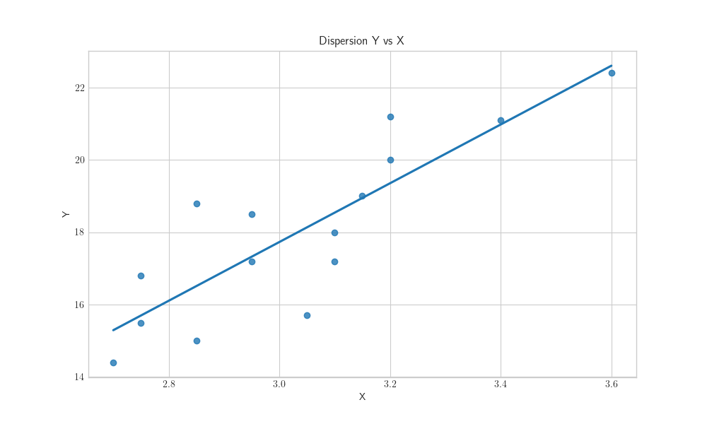

# Regresion Lineal
## Conceptos Básicos

Es un método que permite asociar una o más variables, denominadas independientes($x_1, x_2, ... x_n$), con otra que se tiene como dependiente o respuesta ($y$). Entendiendo que las observaciones en la llamada variable respuesta son eventos relacionados con los valores observados en las variables independientes. 

Cuando dicha asociación tiene lugar entre una variable dependiente y otra independiente, se habla de <i>Regresión Lineal Simple</i>; cuando existe más de una variable independiente se hablará de <i>Regresión Lineal Multiple</i>

Al decir lineal, debe entenderse lineal en los parámetros; es decir ningún parámetro (denotado por $\beta_0$, $\beta_1$ ... $\beta_n$) debe aparecer exponenciado, o multiplicado o dividido por otro parámetro. Por ejemplo:

$$Y=\beta_0+\beta_1x+\epsilon$$

$$Y=\beta_0+\beta_1x + \beta_2x^2+\epsilon$$

$$Y=\beta_0+\beta_1 ln(x)+\epsilon$$

$$Y=\beta_0+\beta_1x_1+ \beta_2 x_2 + \beta_3 x_1x_2+ \epsilon$$

Son todos modelos lineales en los parámetros $\beta_0$, $\beta_1$ ... $\beta_n$

El siguiente modelo, en cambio, no lo es:

$$Y=\beta_0+x^{\beta_1} +\epsilon$$

## Mínimos Cuadrados

El método de estimación más usual de los parámetros es <i>Minimos Cuadrados</i>. cuando los errores se distribuyen como una normal ($\epsilon_i \sim N(0, \sigma^2)$), coinciden con la estimación por <i>Máxima Verosimilitud</i>.

### <i>Asunciones</i> de los Mínimos Cuadrados.

Existen algunos presupuestos o asunciones que deben cumplirse
para garantizar que los resultados e interpretaciones derivadas
de su uso sean los adecuados.

- La media condicional de los errores ($\epsilon_i$) dada $X_i$ 
debe ser cero, esto es: $E(\epsilon_i|X_i)=0$.

- Los pares $(X_i, Y_i),\;\;\;i=1, ..., n$ se corresponden con 
extracciones independientes e indeticamente distribuidas de 
su distribución conjunta.

- Los valores extremos deben ser poco probables. 

La violación de estos presupuestos puede conducir a estimaciones 
distorsinadas, y comprometiendo la validez de los  <i>tests</i> 
de significación.
    

    

La gráfica muestra una serie de observaciones, pares $(y_i, x_i)$, la linea recta representa la tendencia creciente en el comportamiento de esos datos. El método consiste en modelar el comportamiento de esos datos, según una expresión como:

$$Y_i = \beta_0+\beta_1 x_i+ \epsilon_i, \;\;\;i=1, 2, ..., n$$

Dónde cada observación $Y_i$ es una variable aleatoria resultado de la suma de los términos $\beta_0$, $\beta_1$ y del término aleatorio $\epsilon_i$, que representa a las desviaciones de cada una de las observaciones respecto de la recta. Cuando $\epsilon_i=0$ la observación $Y_i$ se ubicará exactamente sobre la linea recta.

Entonces, $\epsilon_i$ es la distancia vertical de una observación cualquiera a la línea de regresión. Además se supone que el valor esperado (<i>esperanza</i>) de esos $\epsilon_i$ sea cero con varianza constante ($\sigma$). Es decir:

$$E(\epsilon_i)=0;\;Var(\epsilon_i)=\sigma^2;\;\;i=1, 2, ...,n.$$

$$Cov(\epsilon_i, \epsilon_i)=0\;\;\;\;\;i\neq j$$

Entonces:
$$E(Y_i) = E(\beta_0+\beta_1 x_i + \epsilon_i) = \beta_0+\beta_1 x_i$$

$$Cov(Y_i, Y_j)=\sigma^2,\;\;\;i \neq j$$

$$Var(Y_i)=Var(\beta_0+\beta_1x_1+\epsilon_i)=Var(\epsilon_i)=\sigma^2.$$

La varianza de $Y_i$ es igual a $\sigma^2$ debido a al efectuar la regresión de $Y$ sobre $X$ (conocida) se está condicionando a $Y$ dada que existe $X$, siendo asi, esa $X$ es una cantidad no aleatoria de la cual los errores son independientes, o sea:

$$Var(y|x)=Var(\beta_0+\beta_1x+\epsilon|x)=Var(\epsilon|x)=Var(\epsilon) = \sigma^2.$$

El método de mínimos cuadrados minimiza la suma de los cuadrados de las desviaciones o distancias de los puntos a la recta. La <i>i-esima</i> desviación o error es:
$$\epsilon_i=Y_i-(\beta_0+\beta_1x_i)$$

Y la suma de los cuadrados de los errores es:
$$\sum_{i=1}^{{n}}e_i^2=\sum_{i=1}^{{n}}(Y_i+\beta_0+\beta_1x_i)^2$$

Los estimadores de mínímos cuadrados de $\beta_0$ y $\beta_1$, se obtinen mediante la diferenciación de la expresión anterior:

$$\frac{\partial\sum \epsilon_i^2}{{\partial\beta_0}}=-2\sum(Y_i-b_0-b_1x_i)=0$$

$$\frac{\partial\sum \epsilon_i^2}{{\partial\beta_1}}=-2\sum x_i(Y_i-b_0-b_1x_i)=0$$

Siendo $b_0$ y $b_1$ los estimadores de mínimos cuadrados de $\beta_0$  $\beta_1$, respectivamente. Al simplificar y distribuir las sumas en las expresiones de arriba:

$$\sum_{i=1}^{{n}}Y_i=nb_0+b_1\sum_{i=1}^{{n}}x_i;\;\;\;\;\;\;(1)$$

$$\sum_{i=1}^{{n}}x_iY_i=b_0\sum_{i=1}^{{n}}x_i+b_1\sum_{i=1}^{{n}}x_i^2;\;\;\;\;\;\;(2)$$

Las expresiones (1) y (2) son las conocidas como <i>ecuaciones normales</i>; al dividir (3) por <i>n</i>, se obtiene:

$$\frac{\sum y_i}{{n}}=b_0+b_1\frac{\sum x_i}{{n}}$$

Y el estimador de mínimos cuadrados de $\beta_0$ es:

$$b_0=\frac{\sum_{i=1}^{{n}} y_i}{{n}}-b_1\frac{\sum_{i=1}^{{n}}x_i}{{n}}=\bar{y} - b_1\bar{x}\;\;\;\;\;\;\;(3)$$

Sustituyendo $(3)$ en $(2)$, resulta:

$$\sum x_iy_i=\left (\begin{array}{c}\frac{\sum y_i}{{n}} - b_1\frac{\sum x_i}{{n}}\end{array} \right ) \sum x_i + b_1\sum x_i^2$$

Luego con el despeje de $b_1$ se llega a:

$$b_1=\frac{\sum_{i=1}^{{n}}x_i y_i - \frac{\left (\begin{array}{c}\sum_{i=1}^n x_i\end{array} \right ) \left ( \begin{array}{c}\sum_{i=1}^n y_i \end{array} \right )}{{n}}}{{\sum_{i=1}^n x_i^2- \frac{(\sum_{i=1}^n x_i)^2}{{n}}}}=\frac{\sum_{i=1}^n (x_i - \bar{x})(y_i-\bar{y})}{{\sum_{i=1}^n (x_i- \bar{x})^2}}\;\;\;\;(4)$$

Los valores $b_1$ y $b_0$ son los que minimizan la suma de los cudrados de los errores.

La recta de regresión estimada para el modelo de regresión simple es:
$$\hat{Y_i}=b_0+b_1x_i$$

La diferencia entre la realización $y_i$ y el valor estimado $\hat{y_i}$ es el estimador del error, o <i>i-ésimo</i> residual: $e_i=y_i - \hat{y_i}$

Algunas propiedades son:

$$\sum_{i=1}^{n}\epsilon_i=0$$

$$\sum_{i=1}^{n}y_i = \sum_{i=1}^{n} \hat{y_i}$$

$$ \sum_{i=1}^{n}x_i \epsilon_i=0$$

### Estimación de la varianza

La varianza del error es la misma que la varianza de la variable
respuesta ($\sigma^2$); que se asume constante para todos los valores de
la variable de predicción. El valor de $\sigma^2$, es desconocido
por lo tanto debe estimarse a partir de los mínimos cuadrados. 
Dado que $\hat{y_i}$ estima la media de $Y_i$ , la diferencia
$y_i - \hat{y_i}$ representa una desviación de $Y_i$ con respecto
 de su propia media. Las desviaciones al cuadrado de una variable
divididas por el número de observaciones, es lo que se conoce como
varianza; en este caso, a dicho número se le sustraera la cantidad
de parámetros que se estan estimando, en la regresión simple son:
$\beta_0$ y $\beta_1$. El estimador es entonces:

$$S^2= \frac{\sum_{i=1}^n(y_i - \hat{y_i})^2}{{n-2}}$$ 

Si las suposiciones (<i>asunciones</i>) requeridas para la 
estimación de mínimos cuadrados se cumplen a cabalidad; 
entonces los estimadores $B_0$ y $B_1$ son los mejores 
estimadores insesgados de $\beta_0$ y $\beta_1$:
$$E(B_1)=\beta_1$$

$$Var(B_1)=\frac{\sigma^2}{{\sum_{i=1}^n (x_i - \bar{x})^2}}
$$

Mientras que:

$$E(B_0)=\beta_0$$

$$Var(B_0)=\frac{\sigma^2\sum_{i=1}^n x_i^2}{{n\sum_{i=1}^n(x_i-\bar{x})^2}}$$

